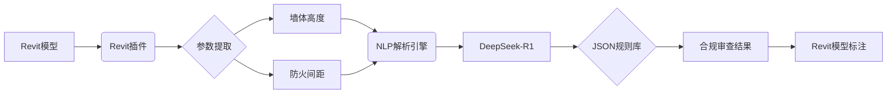

# BIM规范智能审查系统

## 系统架构图

##  功能特性
- **自动化核查**：支持墙体高度、防火间距等关键参数审查
- **智能解析**：集成DeepSeek-R1模型，实现规范文本→结构化规则的转换
- **高效处理**：通过预处理算法减少80%的API调用量

##  环境要求
- Python 3.10+
- Revit 2023+ (插件运行环境)
- DeepSeek API密钥


### 安装依赖
```bash
pip install -r requirements.txt

